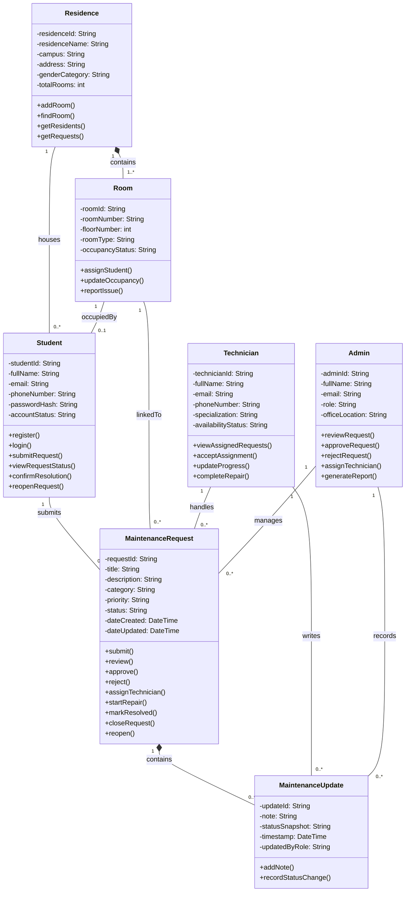

# CampusFix Residence Maintenance System – Class Diagram

## 1. Introduction
This class diagram models the structural design of the CampusFix Residence Maintenance System. It identifies the main classes, their attributes, operations, and relationships. The design is based on the domain model and aligns with the requirements, use cases, user stories, and behavioral diagrams developed in earlier assignments.

## 2. Mermaid Class Diagram

## 3. Explanation of Key Design Decisions

### 3.1 MaintenanceRequest as the core class
MaintenanceRequest is the central class because the whole CampusFix system revolves around the reporting, handling, and resolution of student maintenance issues. Most system interactions either create, modify, assign, or track a maintenance request.

### 3.2 Separation of Student, Admin, and Technician roles
These roles were modeled as separate classes because they have distinct responsibilities in the workflow:
- **Student** reports issues and confirms outcomes.
- **Admin** reviews and assigns requests.
- **Technician** performs repairs and updates progress.

This separation improves clarity and mirrors the actual business process.

### 3.3 Residence and Room as separate structural classes
Residence and Room were modeled separately because maintenance issues occur at room level, while reporting and residence administration often happen at building level. This also makes the design more scalable if the system later supports multiple campuses and many residences.

### 3.4 MaintenanceUpdate for traceability
A separate MaintenanceUpdate class was added to keep a history of notes and status changes. This improves accountability, supports communication, and aligns with real-world maintenance workflows where progress is tracked over time.

## 4. Explanation of Relationships

- **Composition between Residence and Room** means rooms are strongly owned by a residence.
- **Association between Student and MaintenanceRequest** shows that students submit requests.
- **Association between Room and MaintenanceRequest** ensures every issue is tied to a physical location.
- **Association between Technician and MaintenanceRequest** captures repair assignment.
- **Association between Admin and MaintenanceRequest** captures approval and coordination responsibility.
- **Composition between MaintenanceRequest and MaintenanceUpdate** means updates exist as part of a request’s history.

## 5. Alignment with Previous Assignments

This class diagram aligns with earlier CampusFix work in the following ways:

### Assignment 4 – Requirements
The classes support requirements such as issue reporting, request review, assignment, progress tracking, and closure.

### Assignment 5 – Use Cases
The methods in the classes are derived from major use cases such as Submit Maintenance Request, Review Request, Assign Technician, Update Repair Status, Resolve Issue, and Confirm Completion.

### Assignment 6 – Agile User Stories
The classes and methods support user stories like:
- As a student, I want to submit a maintenance issue.
- As an admin, I want to assign a technician.
- As a technician, I want to update repair progress.

### Assignment 8 – State and Activity Diagrams
The MaintenanceRequest class directly reflects the object states and activities already modeled, especially the request lifecycle from Draft to Closed or Reopened.

## 6. Conclusion
The CampusFix class diagram provides a clear object-oriented representation of the residence maintenance system. It shows the core entities, their interactions, and the structure required to support future implementation in code.
