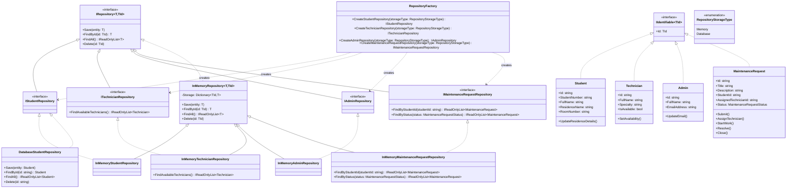

# Assignment 11 Updated Class Diagram

```mermaid
classDiagram
    class IIdentifiable~TId~ {
        <<interface>>
        +Id: TId
    }

    class IRepository~T,TId~ {
        <<interface>>
        +Save(entity: T)
        +FindById(id: TId) T
        +FindAll() IReadOnlyList~T~
        +Delete(id: TId)
    }

    class IStudentRepository {
        <<interface>>
    }

    class ITechnicianRepository {
        <<interface>>
        +FindAvailableTechnicians() IReadOnlyList~Technician~
    }

    class IAdminRepository {
        <<interface>>
    }

    class IMaintenanceRequestRepository {
        <<interface>>
        +FindByStudentId(studentId: string) IReadOnlyList~MaintenanceRequest~
        +FindByStatus(status: MaintenanceRequestStatus) IReadOnlyList~MaintenanceRequest~
    }

    class Student {
        +Id: string
        +StudentNumber: string
        +FullName: string
        +ResidenceName: string
        +RoomNumber: string
        +UpdateResidenceDetails()
    }

    class Technician {
        +Id: string
        +FullName: string
        +Specialty: string
        +IsAvailable: bool
        +SetAvailability()
    }

    class Admin {
        +Id: string
        +FullName: string
        +EmailAddress: string
        +UpdateEmail()
    }

    class MaintenanceRequest {
        +Id: string
        +Title: string
        +Description: string
        +StudentId: string
        +AssignedTechnicianId: string
        +Status: MaintenanceRequestStatus
        +Submit()
        +AssignTechnician()
        +StartWork()
        +Resolve()
        +Close()
    }

    class InMemoryRepository~T,TId~ {
        -Storage: Dictionary~TId,T~
        +Save(entity: T)
        +FindById(id: TId) T
        +FindAll() IReadOnlyList~T~
        +Delete(id: TId)
    }

    class InMemoryStudentRepository
    class InMemoryTechnicianRepository {
        +FindAvailableTechnicians() IReadOnlyList~Technician~
    }
    class InMemoryAdminRepository
    class InMemoryMaintenanceRequestRepository {
        +FindByStudentId(studentId: string) IReadOnlyList~MaintenanceRequest~
        +FindByStatus(status: MaintenanceRequestStatus) IReadOnlyList~MaintenanceRequest~
    }

    class DatabaseStudentRepository {
        +Save(entity: Student)
        +FindById(id: string) Student
        +FindAll() IReadOnlyList~Student~
        +Delete(id: string)
    }

    class RepositoryFactory {
        +CreateStudentRepository(storageType: RepositoryStorageType) IStudentRepository
        +CreateTechnicianRepository(storageType: RepositoryStorageType) ITechnicianRepository
        +CreateAdminRepository(storageType: RepositoryStorageType) IAdminRepository
        +CreateMaintenanceRequestRepository(storageType: RepositoryStorageType) IMaintenanceRequestRepository
    }

    class RepositoryStorageType {
        <<enumeration>>
        Memory
        Database
    }

    IIdentifiable~TId~ <|.. Student
    IIdentifiable~TId~ <|.. Technician
    IIdentifiable~TId~ <|.. Admin
    IIdentifiable~TId~ <|.. MaintenanceRequest

    IRepository~T,TId~ <|-- IStudentRepository
    IRepository~T,TId~ <|-- ITechnicianRepository
    IRepository~T,TId~ <|-- IAdminRepository
    IRepository~T,TId~ <|-- IMaintenanceRequestRepository

    IRepository~T,TId~ <|.. InMemoryRepository~T,TId~
    IStudentRepository <|.. InMemoryStudentRepository
    ITechnicianRepository <|.. InMemoryTechnicianRepository
    IAdminRepository <|.. InMemoryAdminRepository
    IMaintenanceRequestRepository <|.. InMemoryMaintenanceRequestRepository

    InMemoryRepository~T,TId~ <|-- InMemoryStudentRepository
    InMemoryRepository~T,TId~ <|-- InMemoryTechnicianRepository
    InMemoryRepository~T,TId~ <|-- InMemoryAdminRepository
    InMemoryRepository~T,TId~ <|-- InMemoryMaintenanceRequestRepository

    IStudentRepository <|.. DatabaseStudentRepository

    RepositoryFactory ..> IStudentRepository : creates
    RepositoryFactory ..> ITechnicianRepository : creates
    RepositoryFactory ..> IAdminRepository : creates
    RepositoryFactory ..> IMaintenanceRequestRepository : creates
```
