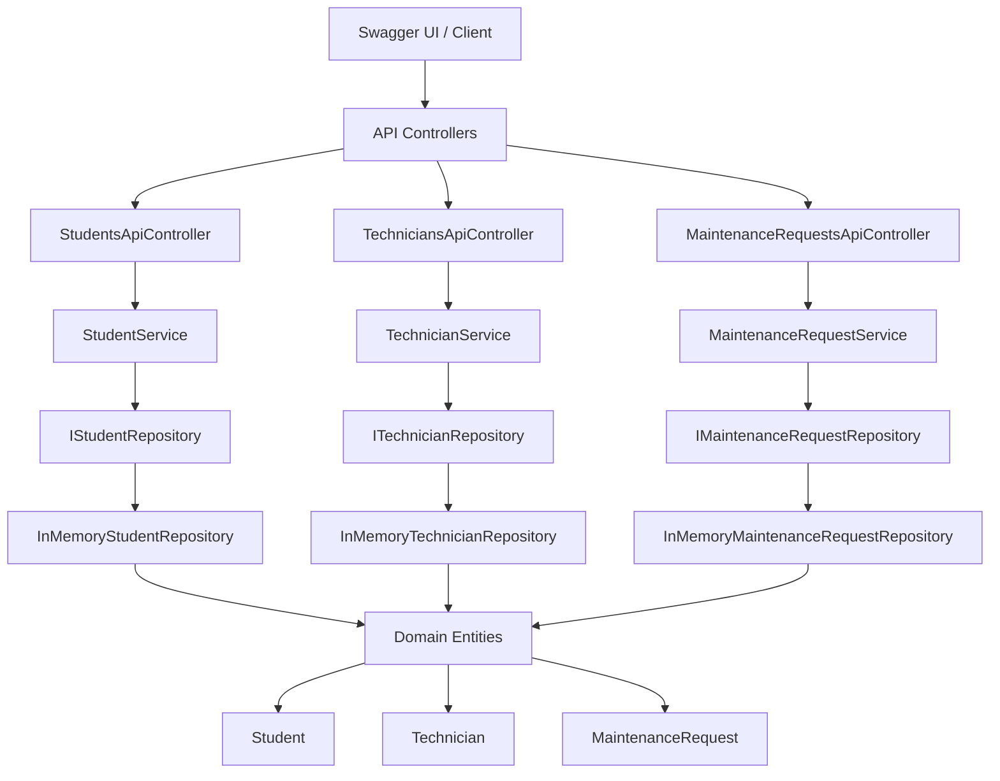

# Assignment 12 – REST API Architecture Diagram

```mermaid
flowchart TD

    A[Swagger UI / Client] --> B[API Controllers]

    B --> C[StudentsApiController]
    B --> D[TechniciansApiController]
    B --> E[MaintenanceRequestsApiController]

    C --> F[StudentService]
    D --> G[TechnicianService]
    E --> H[MaintenanceRequestService]

    F --> I[IStudentRepository]
    G --> J[ITechnicianRepository]
    H --> K[IMaintenanceRequestRepository]

    I --> L[InMemoryStudentRepository]
    J --> M[InMemoryTechnicianRepository]
    K --> N[InMemoryMaintenanceRequestRepository]

    L --> O[Domain Entities]
    M --> O
    N --> O

    O --> P[Student]
    O --> Q[Technician]
    O --> R[MaintenanceRequest]
```